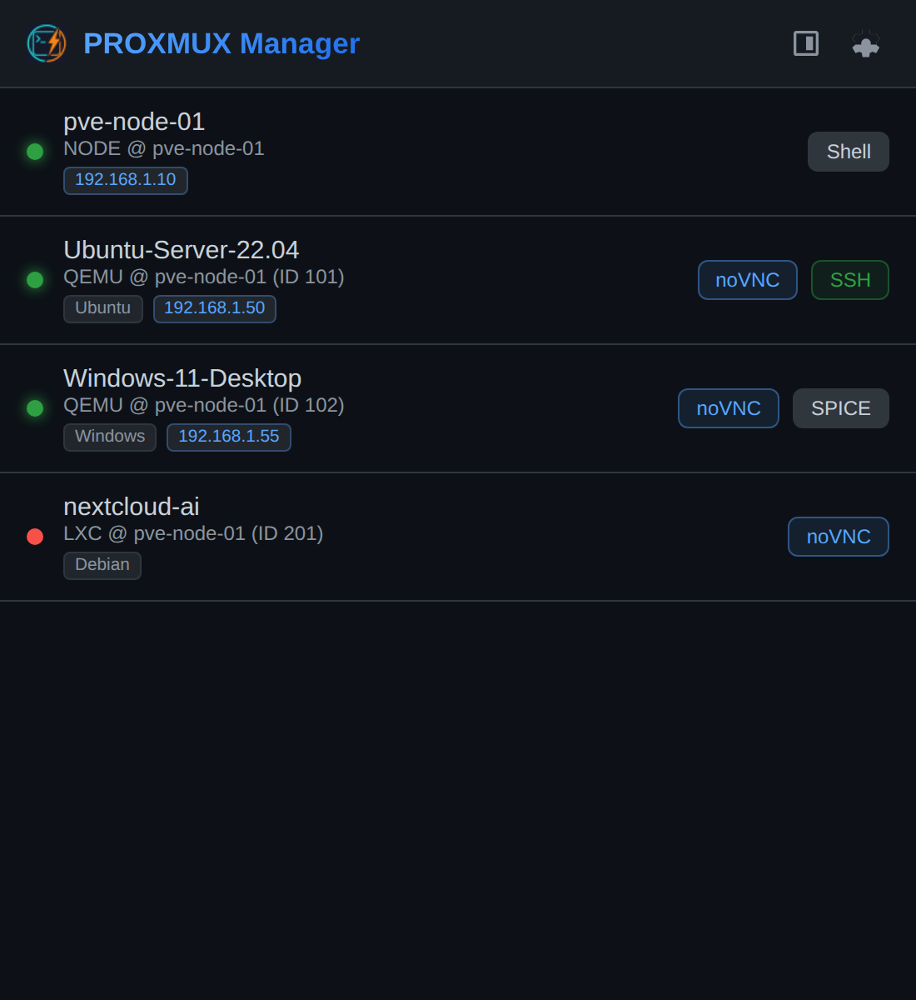
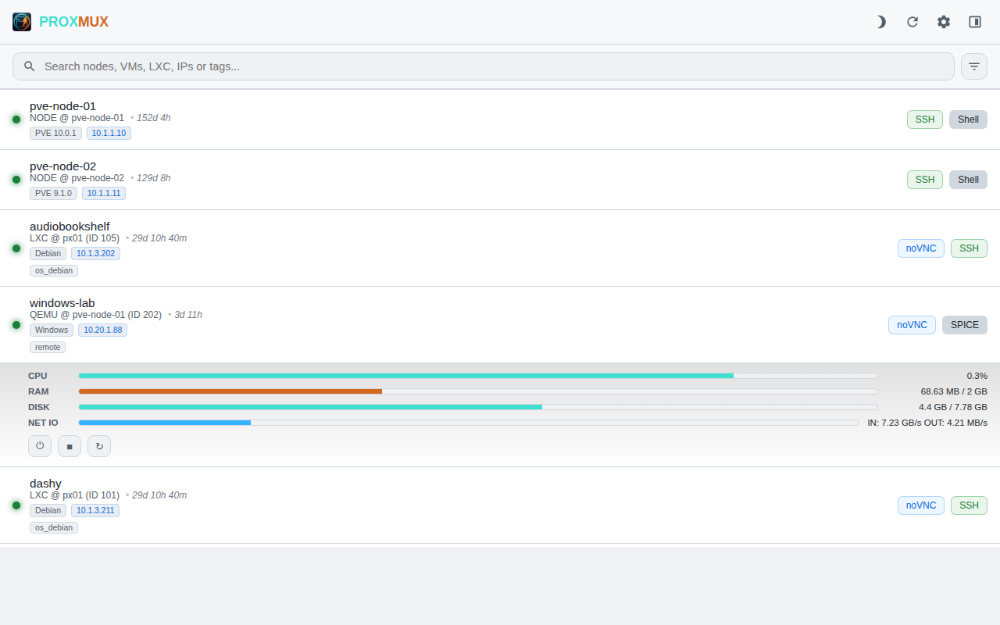

  
  
  

# PROXMUX Manager Chrome Extension

A dedicated Chrome Extension for Proxmox VE cluster management, providing instant access to VM, container, and node consoles.

- **Real-time Search**: Instant filtering by name, ID, node, type, or IP directly in the popup.
- **Advanced Resource Filters**: Quick-access pills to isolate Nodes, VMs, LXCs, and power status (Online/Offline).
- **Intelligent Consoles**:
    - **noVNC**: Direct links to web consoles for VMs and containers.
    - **SPICE**: Detects SPICE availability and provides a one-click .vv file download for remote-viewer.
    - **Shell**: Quick access to host node shells.
- **Improved UX**: Sticky navigation header and automatic search focus for a seamless management experience.
- **Secure**: Uses Proxmox API Tokens for authentication; all credentials stay local.
- **Premium UI**: Modern design with full **Dark** and **Light** mode support (follows system preference).

## UI & Themes

| Dark Mode (Default) | Light Mode |
| :---: | :---: |
|  |  |

## Installation

### From Chrome Web Store (Recommended)
You can install PROXMUX Manager directly from the [Chrome Web Store](https://chrome.google.com/webstore/detail/proxmux-manager) (Coming Soon).

### From Source (Developer Mode)
1. Clone this repository.
2. Open Chrome and go to chrome://extensions/.
3. Enable **Developer mode**.
4. Click **Load unpacked** and select the extension folder.

## Configuration

1. Click the extension icon in the toolbar.
2. Click the **Settings** (gear icon) in the top right to open the dedicated options page.
3. Enter your **Proxmox Cluster Details**:
    - **Proxmox URL**: Your primary node URL (e.g., https://px01.example.com:8006).
    - **User & Realm**: e.g., root@pam.
    - **Token ID**: your API token name (e.g., automation).
    - **API Secret**: the token secret value.
4. Click **Save Settings** and grant host permissions.
5. **High Availability**: Once configured, the extension will automatically discover other cluster nodes and store them for failover.

## Requirements

- Proxmox VE 6.x or newer.
- API Token with appropriate permissions (VM.Console and Sys.Audit for node discovery).

## Version 1.0.0 Release Notes
- **Theme Support**: Full Dark and Light mode support.
- **High Availability**: Automatic cluster node discovery and failover.
- **Dedicated Settings**: New options page for secure and easy configuration.
- **Enhanced Consoles**: Support for SPICE (with auto-open), noVNC, and Shell.
- **Linux Optimized**: Intelligent SSH detection for VMs and LXCs.

## Version 1.1.0 Release Notes
- **Real-time Search**: Integrated deep search across your entire cluster.
- **Resource Filtering**: New type-based (Node/VM/LXC) and status-based (Online/Offline) filters.
- **Sticky UI**: Fixed header and search bar using robust Flexbox layout for better scrolling.
- **Auto-Focus**: Instant interaction with the search field upon opening.
