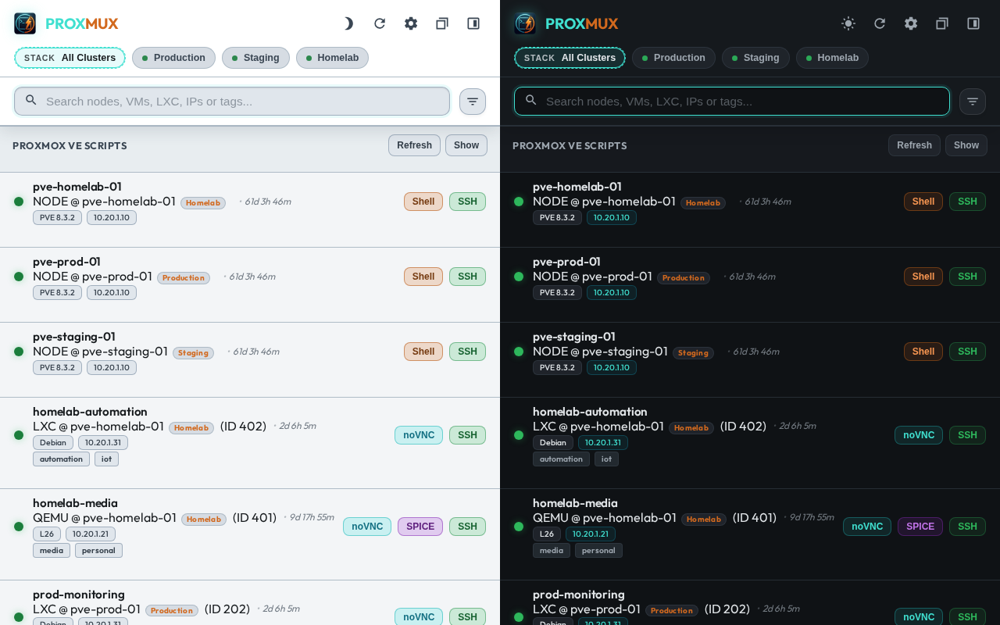
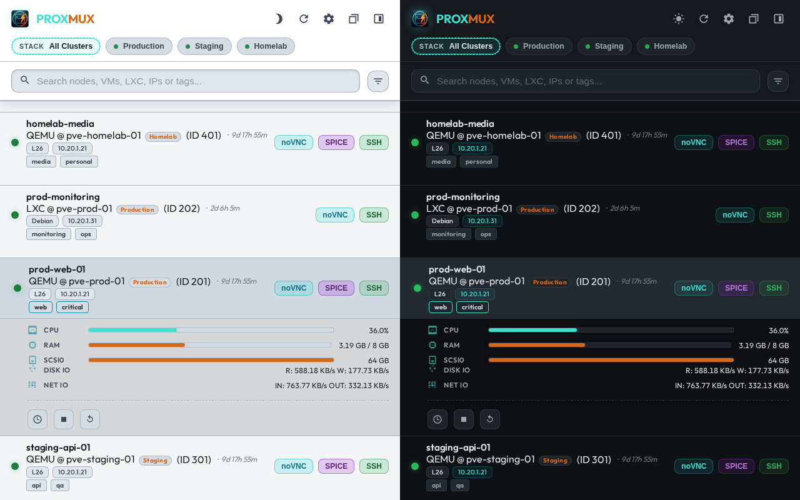
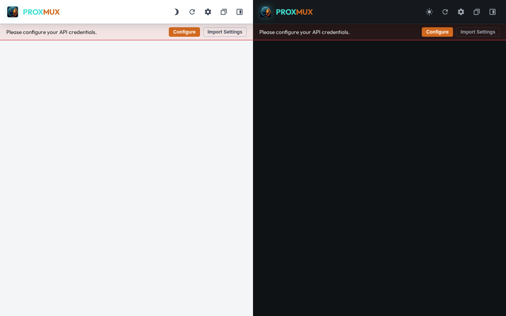
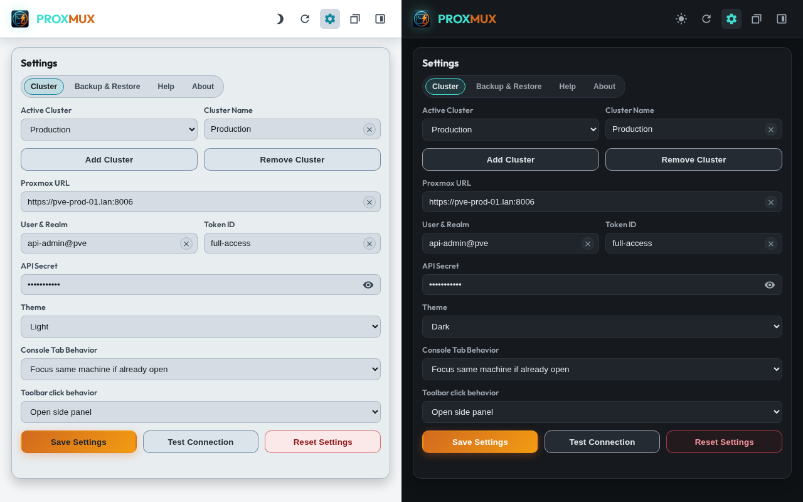
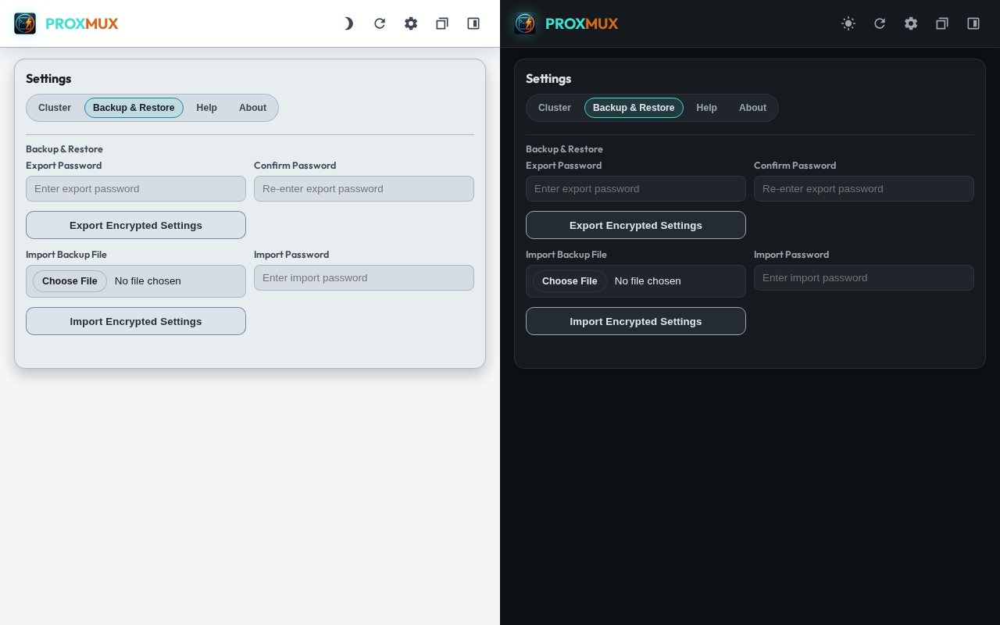

<p align="center">
  <a href="https://github.com/d0dg3r/PROXMUX-Manager/releases"></a>
  <a href="https://github.com/d0dg3r/PROXMUX-Manager/releases?q=beta"></a>
  <a href="https://chrome.google.com/webstore/detail/proxmux-manager"></a>
  <a href="https://github.com/sponsors/d0dg3r"></a>
</p>

# PROXMUX Manager Chrome Extension

A dedicated Chrome Extension for Proxmox VE cluster management, providing instant access to VM, container, and node consoles.

- **Interactive Tags**: Discover and click cluster-wide tags in the search bar for instant categorical filtering.
- **Uptime Monitoring**: Real-time, human-readable uptime (e.g., `2d 5h`) for all running resources.
- **Enhanced Filters**: Quick-access pills to isolate Nodes, VMs, LXCs, and power status.
- **Flexible Launch Modes**: Open PROXMUX in the Side Panel (default) or a persistent floating window.
- **Improved Monitoring**: See VM/LXC status, OS types, and IP addresses at a glance.
- **Intelligent Consoles**: Support for noVNC, SPICE (remote-viewer), and Node Shells.
- **Community Scripts Assist**: Select scripts, copy install commands, and jump directly into host shell.
- **Inline Advanced Settings**: Open and edit settings directly inside the current extension view.
- **Theme Selection**: Manually toggle between **Dark**, **Light**, or **System** themes.
- **Stability and Performance**: Automated node discovery with seamless failover and expired session detection.
- **Secure**: Uses Proxmox API Tokens for authentication; all credentials stay local.

## UI & Themes

- **Multi-Cluster Command Center (Light + Dark)**  
  
- **Live Machine Drill-Down (Light + Dark)**  
  
- **No-Config Guided Start (Light + Dark)**  
  
- **Settings > Cluster (Light + Dark)**  
  
- **Settings > Backup & Restore (Light + Dark)**  
  

## Installation

### From Chrome Web Store (Recommended)
You can install PROXMUX Manager directly from the [Chrome Web Store](https://chrome.google.com/webstore/detail/proxmux-manager) (Coming Soon).

### From Source (Developer Mode)
1. Clone this repository.
2. Open Chrome and go to chrome://extensions/.
3. Enable **Developer mode**.
4. Click **Load unpacked** and select the extension folder.

## Configuration

1. Click the extension icon in the toolbar.
2. Click the **Settings** (gear icon) in the top right to toggle inline advanced settings in the current view.
3. Enter your **Proxmox Cluster Details**:
    - **Proxmox URL**: Your primary node URL (e.g., https://px01.example.com:8006).
    - **User & Realm**: e.g., root@pam.
    - **Token ID**: your API token name (e.g., automation).
    - **API Secret**: the token secret value.
4. Click **Save Settings** and grant host permissions.
5. **High Availability**: Once configured, the extension will automatically discover other cluster nodes and store them for failover.

## Proxmox API Token Setup

- Default recommendation: create a dedicated API user and assign ACLs explicitly.
- Root token setup is available as a fallback for lab/test environments.
- Full guide: [docs/proxmox-token-setup.md](docs/proxmox-token-setup.md)
- Run the interactive helper directly on a Proxmox host:

```bash
curl -fsSL 'https://raw.githubusercontent.com/d0dg3r/PROXMUX-Manager/refs/heads/main/scripts/setup_proxmox_token.sh' -o '/tmp/setup_proxmox_token.sh' && chmod 700 '/tmp/setup_proxmox_token.sh' &&
bash '/tmp/setup_proxmox_token.sh'
```
- The helper asks whether to store the token in a uniquely named local file with restrictive permissions (`600`), default `Yes`.
- Import the token into your password manager immediately, then delete the local token file (`shred -u` preferred, otherwise `rm`).
- zsh-safe curl sample (quotes are important):

```bash
curl -k -s -H 'Authorization: PVEAPIToken=USER_REALM!TOKEN_ID=TOKEN_SECRET' 'https://YOUR_HOST:8006/api2/json/cluster/resources?type=vm'
```

If PROXMUX only shows nodes but not VMs/LXCs, validate token rights first (`Sys.Audit` and VM/LXC audit scope) using the curl checks in the guide.

## Requirements

- Proxmox VE 6.x or newer.
- API Token with appropriate permissions (VM.Console and Sys.Audit for node discovery).

## Community Scripts Integration

- Catalog source strategy: API/JSON first, website fallback.
- Script descriptions are loaded from Community Scripts metadata/page content.
- Install flow is safe assisted: copy command + open shell; no automatic remote execution.
- Integration details: [docs/community-scripts-integration.md](docs/community-scripts-integration.md).

## Release Asset Process

- Screenshot assets are maintained in the release branch/PR as part of release preparation.
- Regenerate with `node store/generate_screenshots_ci.js` when UI changes.
- Commit updated combined assets:
  - `store/screenshot_01_multi_cluster_1280x800.png`
  - `store/screenshot_02_resource_expanded_1280x800.png`
  - `store/screenshot_03_onboarding_1280x800.png`
  - `store/screenshot_04_settings_cluster_1280x800.png`
  - `store/screenshot_05_settings_backup_1280x800.png`

## What's New in v1.2.0

- **Multi-Cluster Factory Reset**: `Reset Settings` now resets all clusters to one default cluster and restores global defaults in both popup and options.
- **No-Config Entry Improvements**: Users can choose `Configure` or `Import Settings` directly from the no-config banner.
- **Import-First Onboarding**: In no-config import mode, backup export and Save/Test actions are hidden to keep restore flow focused.
- **In-Addon Confirmations Only**: Removed native browser confirm/alert dialogs; reset and SPICE error messaging now stays fully inside the extension UI.
- **Store Screenshot Refresh**: Added a 5-scene marketing storyboard that combines Light + Dark views into unified 1280x800 assets.

## Version 1.1.3 Release Notes
- **Reliable Power State Sync**: Improved status refresh flow after start/stop/shutdown/reboot actions to avoid stale status rollbacks.
- **Search Reset UX**: Added clear-search support in the popup search field plus keyboard reset with `Escape`.
- **Top-Bar Layout Fix**: Fixed overlap issues between filter toggle and search clear control.
- **E2E Coverage Expansion**: Added tests for search clear/reset and filter toggle active/collapsed behavior.
- **Store Assets Refresh**: Updated screenshot pipeline and generated both `1280x800` and `640x400` dark/light variants.

## Version 1.1.2 Release Notes
- **Power Features**: Introduced **Interactive Tags** and **Uptime Display** for better cluster oversight.
- **Settings Refactor**: New **Tabbed UI** for settings with expanded **Help** guides (SPICE, SSH, SSL).
- **Theme Control**: Manual theme overrides (Dark/Light/Auto).
- **Branding Excellence**: Official rename to **PROXMUX-Manager** and repository-wide synchronization.
- **Manual Refresh**: Dedicated refresh button in the header.
- **Stability**: Fixed sidepanel height and improved character encoding (UTF-8).

## Version 1.1.1 Release Notes
- **Session Safety**: Robust detection of expired browser sessions using cookie-level checks to prevent 401 errors.
- **Debug Insights**: Real-time status indicators in the popup for better transparency.

## Version 1.1.0 Release Notes
- **Real-time Search**: Integrated deep search across your entire cluster.
- **Resource Filtering**: New type-based (Node/VM/LXC) and status-based (Online/Offline) filters.
- **Sticky UI**: Fixed header and search bar using robust Flexbox layout for better scrolling.
- **Auto-Focus**: Instant interaction with the search field upon opening.

## Version 1.0.0 Release Notes
- **Theme Support**: Full Dark and Light mode support.
- **High Availability**: Automatic cluster node discovery and failover.
- **Dedicated Settings**: New options page for secure and easy configuration.
- **Enhanced Consoles**: Support for SPICE (with auto-open), noVNC, and Shell.
- **Linux Optimized**: Intelligent SSH detection for VMs and LXCs.

## Support the Project

If you find **PROXMUX Manager** useful, please consider supporting its development:

- **Star the Repository**: Help others discover the project.
- **GitHub Sponsors**: [Sponsor d0dg3r](https://github.com/sponsors/d0dg3r) to help maintain the extension.
- **Contribute**: Feel free to open issues or pull requests to improve the extension.
