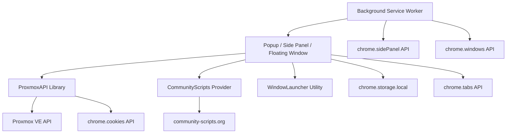

# PROXMUX Manager - Technical Architecture

This document describes the technical architecture and design patterns of the PROXMUX Manager Chrome Extension.

## 1. Overview
PROXMUX Manager is a Chrome Extension (Manifest V3) designed to manage Proxmox VE clusters. It follows a modular architecture separating API logic from the user interface.

## 2. Component Diagram

## 3. Core Components

### 3.1 ProxmoxAPI (`lib/proxmox-api.js`)
The heart of the extension. It encapsulates all communication with the Proxmox VE API.
- **Authentication**: Uses `PVEAPIToken` for all resource-related requests.
- **Session Management**: Specifically checks for the `PVEAuthCookie` using the `chrome.cookies` API to ensure interactive consoles (noVNC, Shell) can be opened without 401 errors.
- **Failover Logic**: Implements a retry mechanism that automatically switches to discovered cluster nodes if the primary node is unreachable.

### 3.2 UI Layer (`popup/`)
The extension uses a shared UI for Side Panel and Floating Window contexts.
- **`popup.html`**: Defines the searchable resource list and filter system.
- **`popup.js`**: Handles state management, filtering, inline settings view toggling, and event delegation. It interacts with `ProxmoxAPI` to fetch data and launch consoles.
- **Multi-Cluster Tabs**: Supports per-cluster context tabs plus an `All Clusters` aggregation mode, including scoped UI state persistence.
- **No-Config Guided Entry**: Provides direct CTA routing to either `Cluster` configuration or `Backup & Restore` import-first onboarding.
- **i18n**: Fully localized using `chrome.i18n` for English and German.

### 3.3 Action Routing Layer (`background.js`, `lib/window-launcher.js`)
- **`background.js`**: Handles toolbar click behavior and routes action open mode (Side Panel or Floating Window) based on saved settings.
- **`lib/window-launcher.js`**: Encapsulates floating window lifecycle and extension URL launch helpers.

### 3.4 Data Storage
Uses `chrome.storage.local` to store:
- Cluster map (`clusters`) with per-cluster credentials and active cluster context (`activeClusterId`, `activeClusterTabId`).
- API Credentials legacy fallback keys (kept synchronized for compatibility).
- Failover Node URLs (discovered dynamically).
- User preferences (theme, display settings, toolbar click mode).
- Community Scripts catalog/details cache and cache TTL settings.

Uses `localStorage` for popup session UX state:
- Last search query.
- Last active type/status filters.
- Last expanded resource item.

## 4. Key Flows

### 4.1 Resource Loading & Failover
1. Extension triggers `api.getResources()`.
2. `ProxmoxAPI` tries the primary URL.
3. If it fails (Network Error), it iterates through `failoverUrls`.
4. On success, it updates the `currentUrl` for the current session and returns data.
5. `popup.js` then calls `updateFailoverNodes()` to keep the node list fresh.

### 4.2 Console Authorization
Before opening a `novnc` or `shell` URL, the extension:
1. Calls `api.checkSession()`.
2. Verifies the presence of `PVEAuthCookie` via `chrome.cookies.get`.
3. Performs a fallback `fetch` with `credentials: 'include'` to double-check.
4. If invalid, displays the **Login Required** overlay.

### 4.3 Power Action Status Synchronization
Power actions (`start`, `shutdown`, `stop`, `reboot`) are handled with a two-stage strategy:
1. Send action to Proxmox (`vmAction` / `nodeAction`).
2. Poll resource status endpoints (`/status/current` or node status) until the target state is confirmed.
3. Store confirmed state in an in-memory override map (`pendingStatusOverrides`) keyed by resource identity.
4. During list refresh (`/cluster/resources`), apply overrides to avoid stale cluster cache rollbacks.
5. Retry refresh with backoff (3s, 6s, 12s) until cluster data catches up and overrides can be cleared.

This prevents transient UI regressions where a resource successfully changed state but briefly reappeared with the previous state.

### 4.4 Search and Filter UX Flow
The popup top-bar search pipeline is designed for fast iterative filtering:
1. User input updates `localStorage` and triggers immediate in-memory filtering.
2. A context-aware clear control is shown only when a query exists.
3. Search reset works via clear button and `Escape`, then re-renders the full filtered list.
4. Filter group visibility is controlled by a collapsible toggle with an explicit active/collapsed visual state.
5. Search, filters, and expanded row state are restored when the popup opens again.

### 4.5 Community Scripts Assisted Install Flow
1. Popup loads Community Scripts catalog via hybrid source strategy (API/JSON first, website fallback).
2. User searches and selects one or more scripts.
3. Extension fetches detail data on demand (About text + install URL).
4. Extension builds trusted install commands and copies them to clipboard.
5. Extension opens target node shell tab; user pastes and executes manually.

### 4.6 Toolbar Click and Window Mode Flow
1. User clicks the browser action icon.
2. `background.js` reads cached default click mode (`sidepanel` or `floating`).
3. For `sidepanel`, the extension opens Side Panel on the last known browser window.
4. For `floating`, `window-launcher` opens (or reuses) a dedicated floating extension window.
5. In UI, users can switch context with header actions; opening one mode closes the other when needed.

### 4.7 Inline Settings View Flow
1. User clicks gear icon in header.
2. Main resource view is replaced with inline advanced settings inside the same extension surface.
3. Save/Test actions run in place and write to `chrome.storage.local`.
4. Gear click or `Escape` toggles back to the main resource list while preserving header controls.

### 4.8 Encrypted Backup / Restore Flow
1. Export collects selected settings keys from `chrome.storage.local`.
2. Payload is encrypted via Web Crypto (PBKDF2 + AES-GCM) and downloaded as a JSON backup.
3. Import decrypts and validates payload, then rewrites storage keys and re-syncs active cluster context.
4. In no-config mode, import-first UX can hide non-essential actions to keep onboarding focused.

### 4.9 Factory Reset Flow (Multi-Cluster)
1. Reset confirmation is performed in-extension with a two-step click model (no native browser dialog).
2. Shared reset service creates one default cluster skeleton and removes previous cluster state.
3. Global defaults are restored (theme/tab mode/display/scripts defaults), legacy credential keys are cleared.
4. UI runtime state is rehydrated to no-config state and list/tabs are refreshed.

## 5. Security Model
- **Token Security**: API Tokens are stored locally in the browser's profile and are never transmitted to any third-party.
- **Least Privilege**: The extension requests only necessary permissions (`storage`, `tabs`, `downloads`, `sidePanel`, `cookies`).
- **Isolation**: All API calls are made from the local extension context.

## 6. Quality and Release Verification
- **E2E Testing**: Playwright test suite validates popup behavior in a controlled mock environment, including search reset and filter toggle interactions.
- **Visual Asset Pipeline**: Store screenshots are generated from deterministic mock scenes (`store/mock/`) for cluster overview, connection onboarding, and settings view.
- **Screenshot Output Format**: Release screenshots are generated as paired Light+Dark captures (`640x800` each) and combined into a single `1280x800` asset per scene.
- **Release Discipline**: Version bumps, docs updates, screenshot refresh, and local test validation are treated as mandatory release gates.
